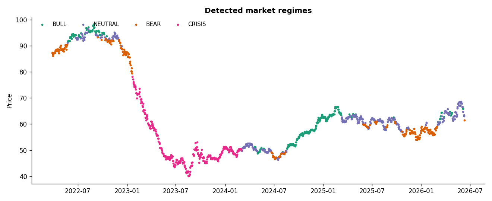

# market-regime-engine

**Regime detection, risk allocation, and live health monitoring for systematic trading systems.**

A compact, well-tested reference implementation of the *regime + risk-control layer* that sits around a trading signal in a production systematic book. It answers the three questions a live system has to answer every day:

1. **What regime are we in?** — a six-indicator classifier mapping price history onto `BULL / NEUTRAL / BEAR / CRISIS`.
2. **How much risk do we take?** — inverse-volatility weighting, portfolio volatility targeting, and a hard exposure cap.
3. **Is it safe to keep trading?** — a monitoring layer with data-integrity checks, a trailing-drawdown kill-switch, and model-stability alerts.

The emphasis throughout is **robustness and explainability over backtest cosmetics**: every regime the engine emits can be traced to the indicators that produced it, and every risk decision is bounded by an explicit mandate.

> This is a generalised, **sanitised** extraction of the regime and risk-control layer from my larger systematic trading system (*AI Capital*). It contains no proprietary alpha — only the engineering that keeps a live book inside its mandate.



*The detector run on a synthetic price series with embedded regimes: BULL (green), NEUTRAL (purple), BEAR (orange), CRISIS (pink).*

---

## Why this exists

Most public trading repos stop at a backtest and a Sharpe ratio. In production, the hard part is everything that happens *after* you have a signal: detecting when the market has changed character, sizing positions so a quiet book doesn't blow up in a vol spike, and knowing — automatically, at 3 a.m. — when the data is bad or the drawdown limit has been breached and trading must stop. This library is that layer.

## Architecture

```
                price / returns
                       │
        ┌──────────────┼───────────────┐
        ▼              ▼               ▼
   RegimeDetector   allocation    HealthMonitor
   6 indicators     inverse-vol   data integrity
   → BULL/NEUTRAL  vol targeting  drawdown kill-switch
     /BEAR/CRISIS  exposure cap   regime stability
        │           top-N         crisis routing
        └──────────────┼───────────────┘
                       ▼
              HealthReport (OK / WARN / CRITICAL, tradeable flag)
```

### 1. Regime detection (`regime_engine/regime.py`)
Six orthogonal indicators — long-term trend, medium- and long-horizon momentum, realised volatility, volatility acceleration, and drawdown — are combined into a 0–6 bullish-evidence score. Hard **crisis gates** (volatility or drawdown extremes) override the score, so tail events are never mislabelled as merely "bearish". `classify_latest()` returns a result you can `.explain()`.

### 2. Risk allocation (`regime_engine/allocation.py`)
The standard risk plumbing of a managed book: `inverse_vol_weights` (risk-parity-style), `apply_vol_target` (scale to a target annualised volatility, capped leverage), `cap_exposure` (gross-exposure limit), and `select_top_n` (concentration).

### 3. Live monitoring (`regime_engine/monitoring.py`)
A battery of checks that runs every cycle and produces a structured, machine- and human-readable `HealthReport`:
- **Data integrity** — missing/stale feeds, non-positive prices, duplicate timestamps, N-sigma spikes.
- **Risk mandate** — trailing-drawdown kill-switch (`tradeable=False` halts the book).
- **Model behaviour** — regime-flip instability and crisis-state routing.

The worst severity across all checks becomes the overall status, designed to drive an automated kill-switch as well as a morning dashboard.

## Quickstart

```bash
pip install -r requirements.txt
python examples/demo.py        # prints reports, writes docs/regime_example.png
```

```python
from regime_engine import RegimeDetector, HealthMonitor

detector = RegimeDetector()
latest = detector.classify_latest(close_prices)      # close_prices: pd.Series
print(latest.explain())
# BULL (score 5/6) | trend=+0.08, mom_mid=+0.04, ...

report = HealthMonitor().run(close=close_prices, equity=equity_curve,
                             regimes=detector.fit(close_prices)["regime"].tolist())
if not report.tradeable:
    halt_trading(report)        # CRITICAL → kill-switch
```

Any data source works — yfinance, a broker export, or a QuantConnect dump — as long as you can hand it a `pandas` series of closes with a datetime index. A `load_ohlcv_csv` helper and a network-free synthetic generator are included.

## Tests

```bash
pip install pytest
python -m pytest -q
```

Covers regime classification (uptrend → BULL, high-vol crash → CRISIS), the drawdown kill-switch, data-integrity edge cases, and report serialisation.

## Project layout

```
regime_engine/      regime.py · allocation.py · monitoring.py · data.py
examples/           demo.py
tests/              test_regime.py · test_monitoring.py
docs/               regime_example.png
```

## Design notes
- **Crisis gates over scores.** A 35%-vol, –20%-drawdown tape is not "a low score" — it's a different state with different rules. Gating prevents the averaging that hides tail risk.
- **Explainable by construction.** Few indicators, transparent scoring; no black box deciding to de-risk your book without telling you why.
- **Fail safe, not fail silent.** The monitor's default on bad data or a breached limit is to mark the book non-tradeable.


## License
MIT — see [LICENSE](LICENSE).
